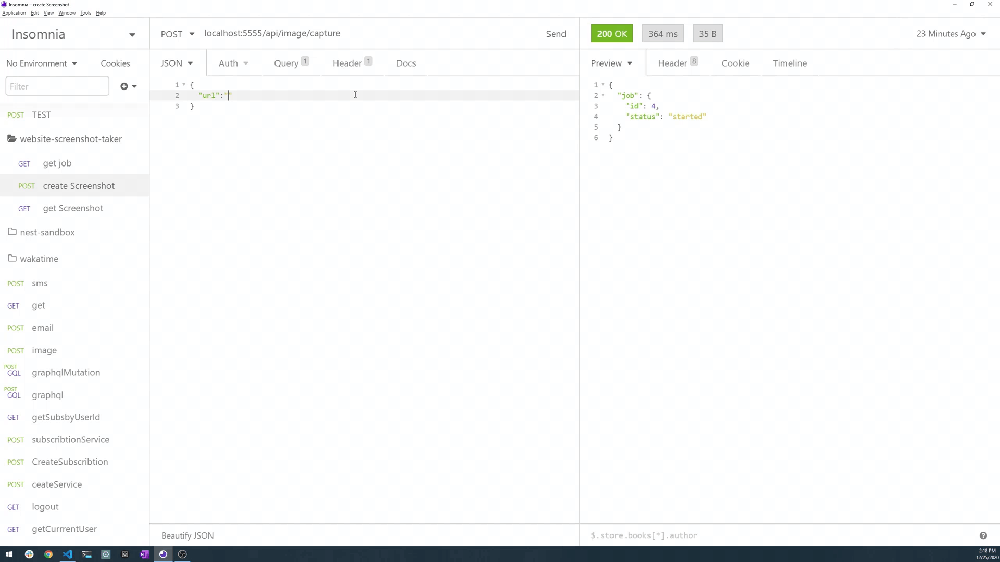

# Taken 📷



Taken is a Website screenshot taker which takes the url as input and provide the image of the website. An event driven arthitecture is used to handle up a load of 1k requests per second.

## Technologies Used

- TypeScript
- Nodejs
- Postgres
- Typeorm
- Redis
- BullMQ
- SocketIO

### Getting Started

- Change connection settings in `typeorm.config.json` file located in root project directory

```bash
npm install
# or
yarn install

npm run build
# or
yarn build


# Normal start: one server
npm start
#or
yarn start


# Deployment Start: Cluster
npm run start:cluster
#or
yarn start:cluster
```

### How?

- Each request will be registered in redis job queue
- Workers process and serve the job asynchronously from the queue
- A workers is operating a squence of service:
  - Image Capture: uses puppeteer as core as headless driver driver for screenshoting
  - Image Save: uses Postgress database to save the image binary in `bytea`
- Displaying the image in a html template on get request
- Load test has been tested using [k6](www.k6.io) with 1500 virtual user requesting the server in the save time
- It could Run as of clustered pool of server workers ensuring our app is a bullet proof!
